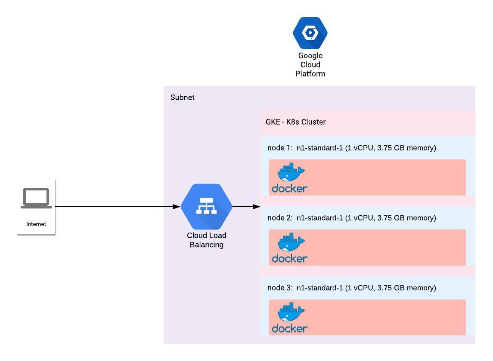

# Proposed Solution 

## Proposed arcuitecture


## Terraform 

IAC solution for timeoff, basically it: (documented on devops/terraform):

* Creates a GCP proyect.
* Creates GKE clusters
* Creates all needed initial gcloud interactions

We could use here other kind of clouds like aws, taking the advantage of terraform being multicloud.  

## CI/CD

### CI
* We are going to use circleCI for making CI pipelines. (documented on devops/circleci)
but we could also use other tools for this purpose, like Gitlab pipelines or Jenkins pipelines
We used circleci  for easy interaction with github.

### CD 

* We are going to use here jenkins pipelines that make the opportunity of an easy interaction 
with GKE clusters. (documented on devops/k8s), to be able to interact with the GKE Jenkins will 
need the "google kubernetes plugin" and be run with dockerfile (devops/k8s/JenkinsDockerfile)

## HTTPS/DNS

* Application will be exposed via the GKE enpoint, that is defined on k8s/ingress.yml as
timeoff-static-ip, we have to buy a public Domain name for this ip and also we have two ways to implement
TLS. one is via buying a certifcate and the second is via adding google self managed https certificates.  

## Solution workflow. 

* 1. Run terraform recipes:
````
terraform init 
terrafrom plan
terraform apply
````
* 2. Connect and run circleci pipelines
````
Trigguer build with a change 
Edit readme and commit 
git commit -am "triguer build" 
````

* 3. Run kubernetes deployment pipelines on Jenkins. 

## Considerations

* We will use GKE, Gcloud sdk and GCR (google cloud docker registry), but other cloud providers could be use the same 
referenced solution. 
* We are not giving much tought IAC (infrastructure as a code) tests.
* Alert policies and monitoring are also out of scope. 
